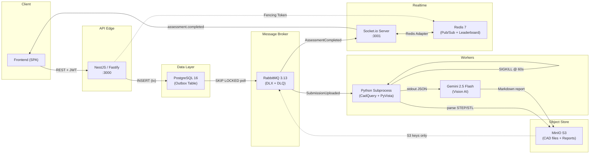

# LeetCAD

Event-driven CAD assessment platform. Turborepo monorepo with NestJS/Fastify API edge, Python subprocess workers, and horizontally scalable WebSocket delivery.

## Architecture



## Monorepo Structure

```
├── apps/
│   ├── core-platform/          NestJS/Fastify API, Auth, Storage, Outbox Relay
│   ├── assessment-engine/      RabbitMQ consumer, Python subprocess, Gemini AI
│   └── realtime-service/       Socket.io + Redis adapter, RabbitMQ consumer
├── packages/
│   └── shared-types/           Cross-service TypeScript interfaces and enums
├── docker-compose.yml          PostgreSQL, Redis, RabbitMQ, MinIO
└── turbo.json                  Build pipeline configuration
```

## System Design & Mitigation Strategies

### 1. Transactional Outbox Pattern

**Failure mode prevented:** Distributed transaction failure between PostgreSQL and RabbitMQ. A naive `INSERT` + `channel.publish()` is not atomic — if the process crashes between the two operations, the event is lost permanently. The message broker has no knowledge of the database state, and the database has no knowledge of the broker state.

**Implementation:** All domain events are written to an `outbox_events` table inside the same PostgreSQL transaction as the business entity mutation. A cron-based relay service (`RelayService`) polls the outbox every second using:

```sql
SELECT * FROM outbox_events
WHERE "publishedAt" IS NULL
ORDER BY "createdAt" ASC
FOR UPDATE SKIP LOCKED
LIMIT 50
```

`SKIP LOCKED` is critical. Without it, concurrent relay instances (or overlapping cron ticks) will deadlock on the same rows. `SKIP LOCKED` causes competing transactions to silently skip already-locked rows instead of blocking, enabling safe horizontal scaling of the relay without coordination.

Each polled event is published to RabbitMQ's `leetcad.events` exchange with a routing key matching the event type. The row's `publishedAt` timestamp is then set, marking it as delivered. If the relay crashes mid-batch, unpublished rows remain `NULL` and are retried on the next tick — achieving at-least-once delivery semantics.

**Dead Letter Exchange (DLX):** Messages that are rejected or expire are routed to `leetcad.events.dlx` → `leetcad.events.dlq` for forensic inspection. Consumer failures never silently disappear.

---

### 2. Claim-Check Pattern

**Failure mode prevented:** RabbitMQ memory exhaustion and broker instability from publishing large binary payloads directly to the message queue.

**Implementation:** The assessment engine produces two heavy artifacts per submission:
1. A rendered PNG image of the CAD geometry (~500KB–5MB)
2. A Gemini-generated Markdown engineering report (~10KB–50KB)

Neither artifact is published to RabbitMQ. Instead, both are uploaded to MinIO via `PutObjectCommand`, and only the resulting S3 keys are included in the `AssessmentCompleted` event payload:

```typescript
{
  submissionId: "uuid",
  userId: "uuid",
  score: 85.5,
  s3ReportKey: "reports/<submissionId>/ai-report.md",
  s3ImageKey: "reports/<submissionId>/render.png"
}
```

Downstream consumers (realtime-service, frontend) dereference the S3 keys on demand. The message broker never handles payloads larger than a few hundred bytes.

---

### 3. Fencing Tokens (Zombie Worker Prevention)

**Failure mode prevented:** A slow or "zombie" worker that was assumed dead (due to a network partition or GC pause) regains connectivity and overwrites the database with stale results, corrupting the submission state.

**Implementation:** Before writing assessment results to PostgreSQL, the worker executes:

```typescript
const fence = await redis.incr(`submission:${submissionId}:fence`);
if (fence > 1) {
  console.warn("Zombie worker or duplicate delivery detected. Dropping write.");
  channel.ack(msg);
  return;
}
```

`INCR` is atomic in Redis. The first worker to reach this point gets `1` and proceeds to write. Any subsequent worker (redelivered message, duplicate consumer) gets `> 1` and aborts. This is a lightweight optimistic concurrency lock that prevents last-write-wins corruption without requiring distributed consensus.

The message is still `ack`'d on the duplicate path to prevent infinite redelivery loops.

---

### 4. Process Isolation & Hard Boundaries

**Failure mode prevented:** C++ OpenCASCADE segfaults, infinite loops in geometric kernel computations, and locked native threads crashing or freezing the Node.js event loop.

**Implementation:** CAD parsing is executed in a fully isolated Python subprocess via `child_process.spawn`. The Node.js process never loads CadQuery, PyVista, or any OpenCASCADE bindings into its own address space.

The subprocess wrapper enforces a hard 60-second timeout:

```typescript
const timeout = setTimeout(() => {
  subprocess.kill("SIGKILL");
  reject(new Error("Process killed due to 60s timeout"));
}, 60_000);
```

`SIGKILL` is used deliberately — `SIGTERM` is insufficient because locked C++ threads in the OpenCASCADE kernel will ignore cooperative termination signals. `SIGKILL` is non-interceptable and guarantees process termination at the OS level.

The timeout is cleared via `clearTimeout` on normal exit or error to prevent timer leaks. Temporary files (STEP input, PNG output) are cleaned up in a `finally` block regardless of outcome.

---

### 5. Horizontally Scalable WebSockets

**Failure mode prevented:** Localized WebSocket broadcasts. Without coordination, a Socket.io `emit` only reaches clients connected to the emitting server instance. In a multi-instance deployment behind a load balancer, users connected to other instances receive nothing.

**Implementation:** The realtime-service uses the `@socket.io/redis-adapter` to synchronize Socket.io rooms across all instances via Redis Pub/Sub:

```typescript
const pubClient = new Redis("redis://localhost:6379");
const subClient = pubClient.duplicate();
io.adapter(createAdapter(pubClient, subClient));
```

When any instance calls `io.to("user:<userId>").emit(...)`, the adapter publishes the event to Redis. All other Socket.io instances subscribed to the same Redis channel receive the event and forward it to locally connected clients in that room.

The leaderboard is maintained in a Redis Sorted Set (`ZADD leaderboard:global <score> <userId>`), enabling O(log N) score updates and O(log N + M) range queries across all instances without database round-trips.

---

### 6. Security & Observability

#### Stateless Google OAuth2

Authentication uses a stateless token exchange — no sessions, no server-side OAuth state. The client obtains a Google ID token via the Google Sign-In SDK and sends it to `POST /auth/google`. The server verifies the token's signature and claims against Google's public keys using `google-auth-library`, upserts the user by `googleId`, and returns a signed JWT. All subsequent requests authenticate via the JWT Bearer token validated by Passport.

The JWT secret is loaded from the `JWT_SECRET` environment variable via `@nestjs/config`, with no hardcoded fallback in production.

#### Runtime DTO Validation (Zod)

All request bodies are validated at the pipe level using Zod schemas before reaching controller logic:

```typescript
@UsePipes(new ZodValidationPipe(GoogleLoginSchema))
async googleLogin(@Body() body: GoogleLoginDto) { ... }
```

Invalid payloads are rejected with a `400 BadRequestException` before any business logic executes. Zod schemas serve as the single source of truth for both runtime validation and TypeScript type inference via `z.infer`.

#### API Edge Protection

| Layer | Implementation | Purpose |
|---|---|---|
| Helmet | `@fastify/helmet` via `app.register(helmet)` | Security headers (CSP, HSTS, X-Frame-Options) |
| CORS | `app.enableCors({ origin: true, credentials: true })` | Cross-origin request policy |
| Rate Limiting | `@nestjs/throttler` — 100 req/min/IP, global `ThrottlerGuard` | Brute-force and DDoS mitigation |

#### Distributed Tracing (OpenTelemetry)

The `@opentelemetry/sdk-node` with `getNodeAutoInstrumentations()` is initialized as the **first import** in `main.ts` — before any driver `require()` calls. This ensures the OpenTelemetry monkey-patches are applied to `http`, `pg`, `amqplib`, and `ioredis` before their native modules are loaded.

Trace context (`traceparent` headers) propagates automatically across HTTP boundaries and RabbitMQ message headers, enabling end-to-end latency analysis from API ingress through subprocess execution to WebSocket delivery.

#### Structured Logging

All application logs are emitted as flat JSON via Winston with `format.json()`. No colorization, no `simple()` format, no pretty-print. Every log line is a single JSON object with `timestamp`, `level`, `message`, `context`, `trace_id`, and `span_id` fields — directly ingestible by ELK, Datadog, or any log aggregator without parsing rules.

## Infrastructure (Docker Compose)

| Service | Image | Ports | Credentials |
|---|---|---|---|
| PostgreSQL | `postgres:16-alpine` | `5432` | `leetcad` / `leetcad_dev` |
| Redis | `redis:7-alpine` | `6379` | — |
| RabbitMQ | `rabbitmq:3-management-alpine` | `5672`, `15672` | `guest` / `guest` |
| MinIO | `minio/minio` | `9000`, `9001` | `leetcad` / `leetcad_dev` |

```bash
docker compose up -d
docker compose ps          # Verify all 4 services are healthy
```

## Quick Start

```bash
# Install dependencies
npm install

# Start infrastructure
docker compose up -d

# Create MinIO buckets
docker exec leetcad-minio mc alias set local http://localhost:9000 leetcad leetcad_dev
docker exec leetcad-minio mc mb local/leetcad-uploads local/leetcad --ignore-existing

# Build all packages
npx turbo run build

# Start services
node apps/core-platform/dist/main.js        # API on :3000, Swagger on :3000/api
node apps/realtime-service/dist/index.js     # WebSocket on :3001
```

## API Reference

Interactive Swagger UI available at `http://localhost:3000/api` when the core-platform is running.

| Method | Endpoint | Auth | Description |
|---|---|---|---|
| `POST` | `/auth/google` | None | Exchange Google ID token for JWT |
| `POST` | `/storage/presigned-url` | Bearer JWT | Generate MinIO presigned upload URL |
| `POST` | `/submissions/complete` | Bearer JWT | Mark upload complete, trigger assessment |
| `WS` | `ws://localhost:3001?userId=<id>` | Query param | Real-time assessment notifications |

## License

Proprietary. All rights reserved.
