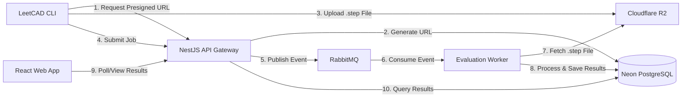

# LeetCAD

[](https://app.leetcad.me)
[](https://leetcad.me/api/docs)
[](https://www.npmjs.com/package/@nigam_developer/leetcad)

LeetCAD is a revolutionary platform for mechanical and hardware engineers to practice, evaluate, and perfect their 3D Computer-Aided Design (CAD) skills. Operating on a modern, highly scalable architecture, LeetCAD provides instant, asynchronous evaluation of `.step` files through a robust CLI and an immersive 3D web viewer. 

---

## Architecture Overview

The system leverages a decoupled, asynchronous microservices architecture optimized for heavy file uploads and computationally intensive geometric evaluations.


```mermaid
flowchart LR
    %% Entities
    Client[LeetCAD CLI]
    Web[React Web App]
    API[NestJS API Gateway]
    S3[Cloudflare R2]
    Queue[RabbitMQ]
    Worker[Evaluation Worker]
    DB[(Neon PostgreSQL)]

    %% Flow
    Client -- 1. Request Presigned URL --> API
    API -- 2. Generate URL --> DB
    Client -- 3. Upload .step File --> S3
    Client -- 4. Submit Job --> API
    API -- 5. Publish Event --> Queue
    Queue -- 6. Consume Event --> Worker
    Worker -- 7. Fetch .step File --> S3
    Worker -- 8. Process & Save Results --> DB
    Web -- 9. Poll/View Results --> API
    API -- 10. Query Results --> DB
```

---

## Features Breakdown

*   **Global CLI Experience:** Submit designs natively from your terminal using the `@nigam_developer/leetcad` package. Seamlessly authenticates with the web platform and handles massive file uploads without breaking a sweat.
*   **Asynchronous Evaluation Engine:** A distributed background processing architecture built on RabbitMQ guarantees that heavy geometric diffing and CAD evaluation tasks never block the main event loop.
*   **Interactive 3D Web Viewer:** Review your submissions and diffs directly in the browser with an advanced, WebGL-powered 3D viewer that highlights geometric discrepancies.

---

## Developer Quickstart

To get started with LeetCAD locally, follow these steps:

### 1. Global Installation
Install the official LeetCAD CLI package globally via npm:
```bash
npm install -g @nigam_developer/leetcad
```

### 2. Authentication
Log in via the CLI to link your terminal with your web session. This stores a long-lived JWT in your local configuration.
```bash
leetcad login
```

### 3. Submission
Navigate to your project directory containing your `.step` file and submit it against a problem slug.
```bash
leetcad submit <problem-slug> ./my-solution.step
```

---

## Tech Stack

| Category         | Technologies |
| :---             | :--- |
| **Frontend**     | React, TypeScript, WebGL (Three.js), Tailwind CSS |
| **Backend**      | NestJS (Fastify), TypeScript, Prisma ORM |
| **Storage**      | Neon (Serverless PostgreSQL), Cloudflare R2 (Object Storage) |
| **Infrastructure** | RabbitMQ, Azure VM, Docker, Node.js |
